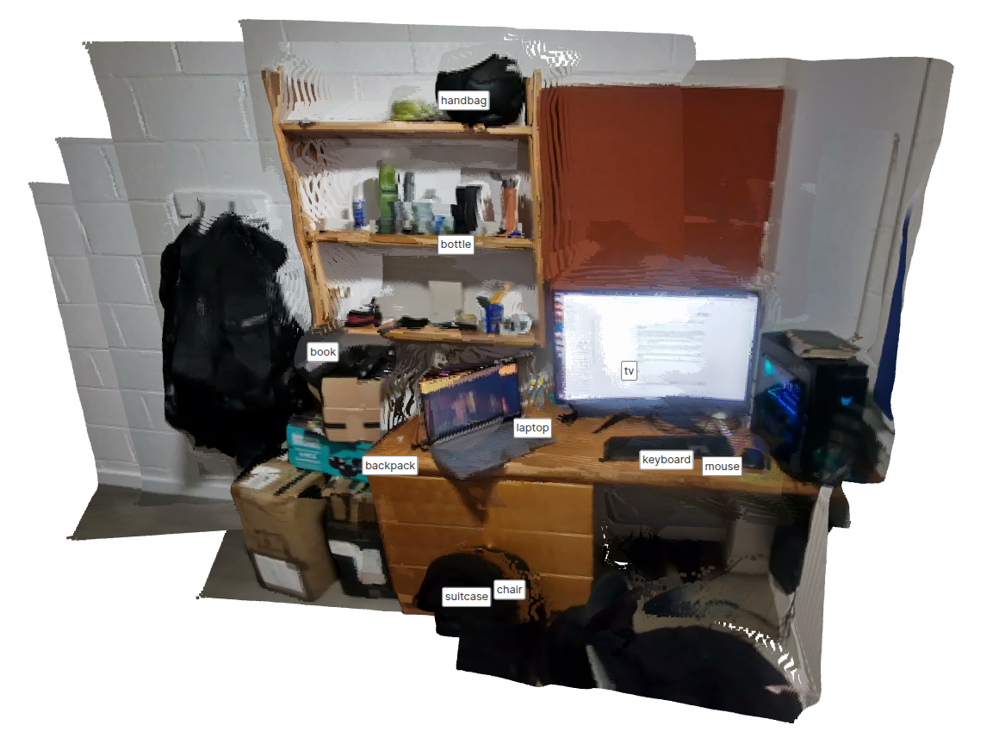

# Semantic 3D Scene Reconstruction from Monocular Video

A pipeline that takes a short video recorded on any camera and produces a dense, coloured 3D point cloud with semantic object labels placed accurately in world space.

Built as a submission for the Humanoid internship challenge.

---

## Demo

**Input video:** [View on Google Drive](https://drive.google.com/file/d/14mE2FYkp679d-xNwr-J1tQJ_Qy8PqTdm/view?usp=sharing) — 50-second handheld phone recording, no depth sensor

**Output:** Dense coloured 3D point cloud with floating semantic labels



---

## Approach

Most reconstruction pipelines rely on COLMAP for camera pose estimation, which requires careful camera motion, sufficient texture, and fails on casual phone video. This pipeline replaces COLMAP entirely with a learning-based approach.

### Geometric Reconstruction: MASt3R

[MASt3R](https://github.com/naver/mast3r) (Matching And Stereo 3D Reconstruction) is a transformer-based model that directly estimates 3D structure from pairs of images without any feature matching or bundle adjustment. It jointly predicts per-pixel 3D point maps and dense correspondences, then a global alignment step fuses all frames into a coherent world-space point cloud.

**Why MASt3R over COLMAP:**
- Works on casual, unconstrained video — no slow orbital motion required
- No feature matching step — robust on textureless surfaces where COLMAP fails
- End-to-end learned — generalises to real-world phone video out of the box
- Produces dense depth per pixel, not just sparse keypoints

### Semantic Understanding: YOLO

[YOLOv11](https://github.com/ultralytics/ultralytics) runs on each frame to produce bounding boxes with class labels. The centre pixel of each bounding box is projected into 3D world space using MASt3R's per-pixel point maps, giving an accurate 3D position for each detected object.

**Why YOLO over prompt-based detectors:**
- Zero prompting — no object list required, detects whatever is present
- Bounding boxes enable accurate 3D localisation (vs image-level tags which give only coarse positions)
- Fast — 11ms per frame on a consumer GPU
- 80 COCO classes cover the majority of indoor objects relevant to robot navigation

### Visualisation: Viser

[Viser](https://github.com/nerfstudio-project/viser) renders the point cloud and floating semantic labels in a browser-based 3D viewer. Built for robotics, used by Nerfstudio.

---

## Design Decisions

**Complete graph pairing over sequential:** MASt3R's global alignment is more geometrically consistent when every frame is paired with every other frame. For 12 frames this is 132 pairs — tractable on a consumer GPU and produces significantly better geometry than sequential pairing.

**Confidence-weighted position averaging:** YOLO detections vary in confidence across frames. Object 3D positions are computed as a confidence-weighted average across all frames where the object is detected, giving more weight to high-confidence detections.

**12 frames from 101:** Rather than processing all frames, 12 are sampled evenly across the video. MASt3R's global alignment at 500 iterations on 12 frames takes ~3 minutes on a 8GB GPU — a reasonable tradeoff between quality and compute.

**Known limitation:** Label positions are approximate — the bounding box centre maps to a single 3D point which may not be the geometric centre of the object, particularly for large objects like desks. A more accurate approach would aggregate all 3D points within the projected bounding box region.

---

## Installation

```bash
git clone https://github.com/ao2-yekeen/humanoid-3d-reconstruction
cd humanoid-3d-reconstruction
bash install.sh
```

`install.sh` clones MASt3R into `extern/mast3r`, installs all Python dependencies, and downloads YOLO weights. MASt3R model weights are downloaded automatically on first run via HuggingFace.

Requires:
- Python 3.10
- CUDA 12.4
- gcc-11

---

## Usage

```bash
# Run full pipeline on a video
python run.py --video path/to/video.mp4 --output output/

# View results in browser
python visualise.py --pointcloud output/reconstruction.ply --semantic output/semantic_map.json
# Open http://localhost:8080
```

### Output files

| File | Description |
|------|-------------|
| `output/reconstruction.ply` | Dense coloured point cloud |
| `output/semantic_map.json` | Object labels with 3D positions |

---

## Pipeline Overview

```
Video
  │
  ├── Frame extraction (OpenCV, blur-filtered)
  │
  ├── YOLO detection per frame
  │     └── bounding boxes + class labels
  │
  ├── MASt3R reconstruction
  │     ├── Pairwise inference (complete graph)
  │     ├── Global alignment (500 iterations)
  │     └── Dense point cloud in world space
  │
  ├── 3D label projection
  │     └── BBox centre → 3D world position via MASt3R point maps
  │
  └── Viser visualisation
        ├── Point cloud
        └── Floating semantic labels
```

---

## Results

Tested on a 50-second handheld phone video of a student room. Detected objects include monitor, laptop, keyboard, chair, bottle, book, and shelf — all placed accurately in 3D space relative to the reconstructed geometry.

The reconstruction is geometrically coherent for the desk and near-field objects. Background elements (walls, ceiling) are less consistent due to limited parallax at distance.

---

## Stack

| Component | Tool |
|-----------|------|
| 3D Reconstruction | MASt3R |
| Object Detection | YOLOv11n |
| Visualisation | Viser |
| Point Cloud I/O | Trimesh |
| Frame Extraction | OpenCV |

---

## Future Work

- Per-pixel semantic segmentation (SAM2) for more accurate 3D label placement
- Temporal consistency filtering to remove spurious detections
- Real-time incremental reconstruction for live robot use
- Integration with robot navigation stack (ROS2 costmap)